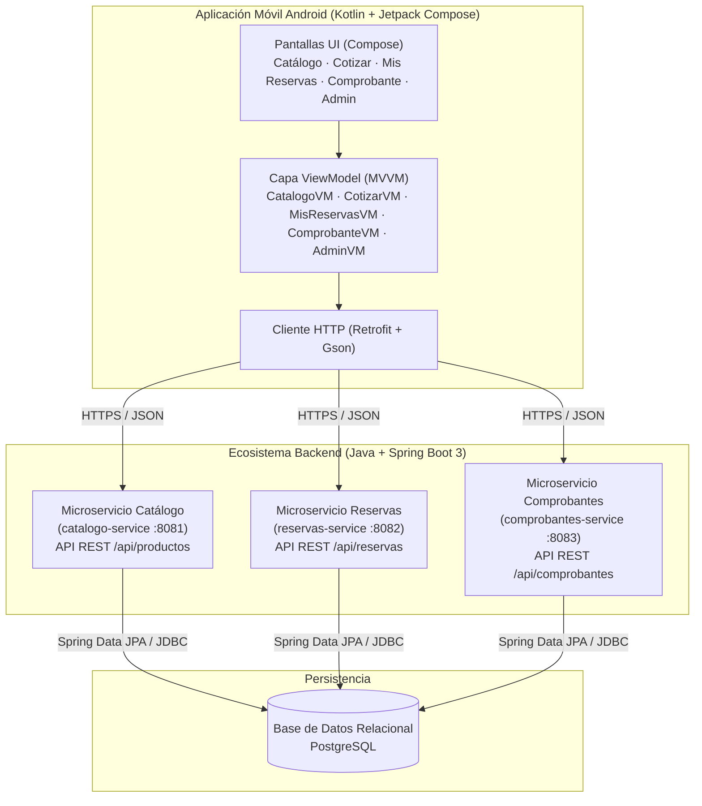
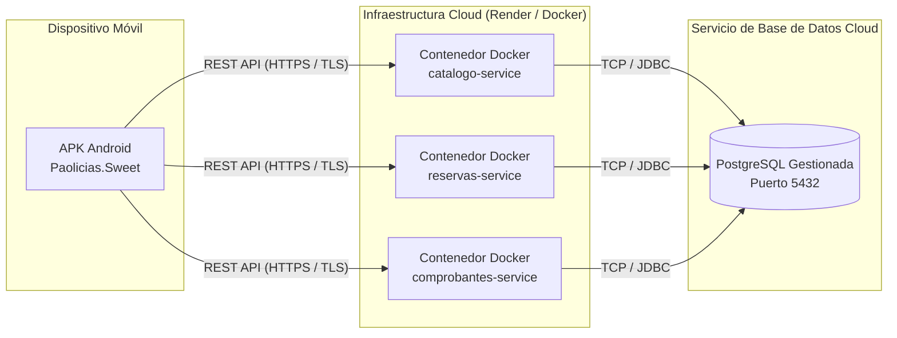

# Arquitectura del Sistema — Paolicias.Sweet

## 1. Diagrama de Arquitectura de Software (Componentes y Microservicios)

```mermaid
flowchart TB
    subgraph Android["Aplicación Móvil Android (Kotlin + Jetpack Compose)"]
        UI["Pantallas UI (Compose)<br/>Catálogo · Cotizar · Mis Reservas · Comprobante · Admin"]
        VM["Capa ViewModel (MVVM)<br/>CatalogoVM · CotizarVM · MisReservasVM · ComprobanteVM · AdminVM"]
        RET["Cliente HTTP (Retrofit + Gson)"]
        UI --> VM --> RET
    end

    subgraph Backend["Ecosistema Backend (Java + Spring Boot 3)"]
        MS1["Microservicio Catálogo<br/>(catalogo-service :8081)<br/>API REST /api/productos"]
        MS2["Microservicio Reservas<br/>(reservas-service :8082)<br/>API REST /api/reservas"]
        MS3["Microservicio Comprobantes<br/>(comprobantes-service :8083)<br/>API REST /api/comprobantes"]
    end

    subgraph Data["Persistencia"]
        DB[("Base de Datos Relacional<br/>PostgreSQL")]
    end

    RET -- "HTTPS / JSON" --> MS1
    RET -- "HTTPS / JSON" --> MS2
    RET -- "HTTPS / JSON" --> MS3

    MS1 -- "Spring Data JPA / JDBC" --> DB
    MS2 -- "Spring Data JPA / JDBC" --> DB
    MS3 -- "Spring Data JPA / JDBC" --> DB
```

---

## 2. Diagrama de Despliegue y Flujo de Comunicación en la Nube

```mermaid
flowchart LR
    subgraph Cliente["Dispositivo Móvil"]
        APP["APK Android<br/>Paolicias.Sweet"]
    end

    subgraph Cloud["Infraestructura Cloud (Render / Docker)"]
        C1["Contenedor Docker<br/>catalogo-service"]
        C2["Contenedor Docker<br/>reservas-service"]
        C3["Contenedor Docker<br/>comprobantes-service"]
    end

    subgraph DBCloud["Servicio de Base de Datos Cloud"]
        PG[("PostgreSQL Gestionada<br/>Puerto 5432")]
    end

    APP -- "REST API (HTTPS / TLS)" --> C1
    APP -- "REST API (HTTPS / TLS)" --> C2
    APP -- "REST API (HTTPS / TLS)" --> C3

    C1 -- "TCP / JDBC" --> PG
    C2 -- "TCP / JDBC" --> PG
    C3 -- "TCP / JDBC" --> PG
```